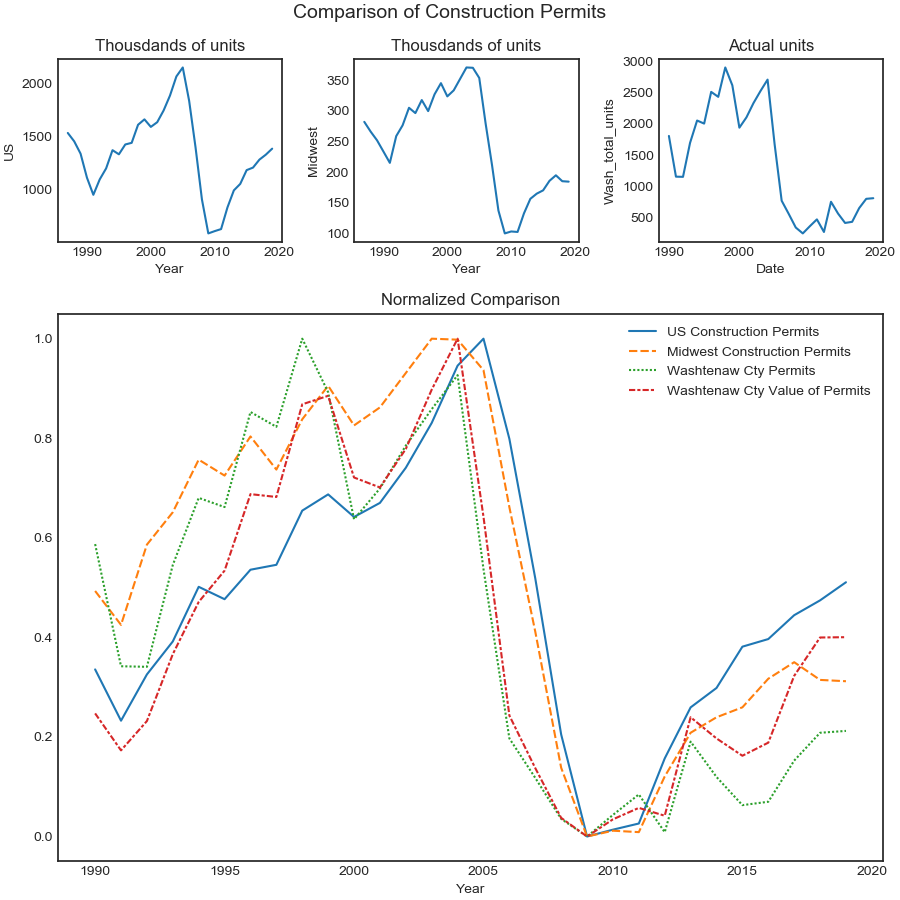

<h2 align="center">Comparison in New Construction Permits Issued</h2>

The intent of this analysis was to re-exam the premise that college towns are more resilient to economic crises.  Previous analysis looked at housing prices to observe fewer changes in college towns as a result of macro-economic recessions.  This analysis approaches the topic of college town resilience by examining the number of construction permits issued for residential properties and observes features before and after the 2008 crash.  The levels of analysis are US, region (The Midwest includes  Illinois, Indiana, Michigan, Ohio, Wisconsin, Iowa, Kansas. Minnesota, Missouri, Nebraska, North Dakota, and South Dakota), and County Level.   The goal is to place the city of Ann Arbor Michigan in the context of the behavior of college towns as seen through residential construction. 

After several emails with the government of the City of Ann Arbor construction permit information at the city level remains unavailable.  Therefore the lowest level of analysis available is the county, Washtenaw County.  Washtenaw County has both the University of Michigan and Eastern Michigan University so should be a reliable expression of trends in construction permit issuance based on having a college town. 

The data used in analysis was provided by the US Census service: <a href="https://www.census.gov/construction/bps/permitsbyusreg_cust.xls">National and Regional</a> and <a href="https://www2.census.gov/econ/bps/County/">Washtenaw County</a>

Getting the Washtenaw County information required copying that county from the full county information.  I consolidated Washtenaw County to a .csv file posted to my <a href="https://gist.githubusercontent.com/Cameron-Grams/ffd22a38beb314b2390b87eddc4817f9/raw/a51d3bd1740821ffc7dcd0ec9a90753ca267123c/Wastenaw_Construction_Permits.csv ">GitHub</a>

The graph has the US, Midwest, and Washtenaw County displayed in context.  The upper row of graphs show the number of new residential construction permits issued in the US, Midwest and Washtenaw County.  The scale in the numbers issued is orders of magnitude higher for the US and region, but the decrease in new construction is clear across all three graphs. 

The lower graph has normalized values that place new residential construction in the US, Midwest and Washtenaw County on a comparable scale.  The 3 significant features from this graph are first that there was greater construction of new residential property prior to the crash in both the Midwest and Washtenaw County than the US rate of construction (the orange and green lines are higher than the blue before the crash), second that the rate of construction in the Midwest and Washtenaw County is lower than the US after 2009 (the orange and green lines are below blue), and third that the value of the construction taking place in Washtenaw County after the crash has exceeded the relative volume of construction in Washtenaw County (the red line is above the green).  The migration towards higher value relative to volume of construction in Washtenaw County can be seen starting approximately in 2003, but after 2011-2012 the difference has increased each year. 

This suggests that based on the analysis of new construction of residential property the recovery in the Midwest and Washtenaw County has been slower than the US rate of recovery and the new construction in Washtenaw County has been concentrated in higher value properties.  

